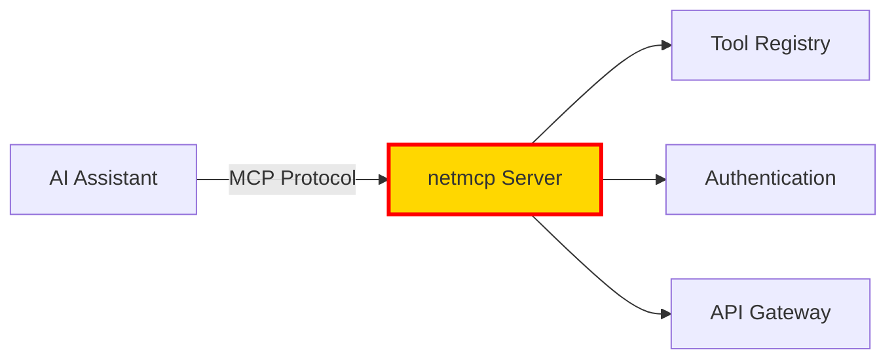

<div align="center">


# 🌐 **theWannaBeeesz Collective**

### *The Infrastructure Tinkerer*


---

```typescript
const whoBcode = {
  identity: "Elite Collective",
  architecture: { humans: 6, aiNodes: 6 },
  location: "Silicon Valley, CA",
  mission: "Surpass. Evolve. Dominate.",
  philosophy: () => {
    while(true) {
      LEARN();
      ADAPT();
      DOMINATE();
      EVOLVE();
    }
  }
};
```

</div>

---

## 🚀 **Core Expertise**

<table>
<tr>
<td width="50%">

### ⚡ **Cloudflare Serverless Evangelist**
Deep expertise in serverless architecture, deploying cutting-edge applications on **Cloudflare Workers**, **KV**, **D1**, **R2**, and the entire Cloudflare stack.

</td>
<td width="50%">

### 🤖 **AI/ML Multi-Agent Systems Builder**
Pioneering systems where multiple AI agents collaborate, orchestrate, and self-improve through feedback loops and emergent intelligence.

</td>
</tr>
<tr>
<td width="50%">

### 🛠️ **Full-Stack Infrastructure Developer**
**TypeScript-heavy** (59%+) with mastery across JavaScript, Python, Go, and Shell. Infrastructure-as-Code mindset driving every project.

</td>
<td width="50%">

### 🔮 **Model Context Protocol Pioneer**
Early adopter and experimenter with MCP technology, building bridges between AI systems and real-world tools.

</td>
</tr>
</table>

---

## 💫 **What We're Building**

### 🎯 **AI Agent Systems & Multi-Agent Platforms**

> *The frontier of human-AI collaboration*

| Project | Description | Stack |
|---------|-------------|-------|
| **[agent](https://github.com/whobcode/agent)** | Multi-tenant platform for creating AI agents that collaborate and self-improve | TypeScript, Cloudflare Workers |
| **[jarvis-ai-assistant](https://github.com/whobcode/jarvis-ai-assistant)** | Production-ready multi-agent AI with orchestrator, reasoning, research, and task agents | TypeScript, Cloudflare Stack |
| **[chatai2](https://github.com/whobcode/chatai2)** | Web interface for interacting with local LLMs via Ollama | JavaScript, Cloudflare Workers |
| **[chat4](https://github.com/whobcode/chat4)** | Agent making agents - recursive AI creation | MIT License |
| **[superChildvising](https://github.com/whobcode/superChildvising)** | Agent supervision and orchestration system | JavaScript |

---

### 🔗 **Model Context Protocol (MCP) Integration**

> *Extending AI capabilities through standardized protocols*



- **[netmcp](https://github.com/whobcode/netmcp)** - MCP server with intelligence tools (GitHub OAuth)
- **[playwmcp](https://github.com/whobcode/playwmcp)** - MCP experimentation playground
- **[remote-mcp-server-authless](https://github.com/whobcode/remote-mcp-server-authless)** - Remote MCP without auth
- **[mcp](https://github.com/whobcode/mcp)** - Python-based MCP implementation

---

### ☁️ **Cloudflare Infrastructure Projects**

> *Edge computing at planetary scale*

<div align="center">


</div>

- **[stream](https://github.com/whobcode/stream)** - Reolink NVR Cloudflare Stream Proxy (7 camera feeds)
- **[cf-workers-telegram-bot](https://github.com/whobcode/cf-workers-telegram-bot)** - Telegram bot library for Workers
- **[to-do-list-kv-template](https://github.com/whobcode/to-do-list-kv-template)** - Cloudflare KV storage template
- **[data4r2](https://github.com/whobcode/data4r2)** - Cloudflare R2 data project

---

### 🧰 **Development Tools & Templates**

> *Rapid prototyping infrastructure*

| Tool | Purpose | Language |
|------|---------|----------|
| **[fullstack](https://github.com/whobcode/fullstack)** | Full-stack application template | TypeScript |
| **[boilerplate](https://github.com/whobcode/boilerplate)** | Python project boilerplate | Python |
| **[prototype](https://github.com/whobcode/prototype)** | Experimental development sandbox | - |
| **[embed](https://github.com/whobcode/embed)** | Jupyter Notebook experiments | Jupyter |
| **[hello-containers](https://github.com/whobcode/hello-containers)** | Container experimentation | Jupyter |

---

## 🎨 **Development Philosophy**

<div align="center">

```ascii
╔═══════════════════════════════════════════════════════════╗
║                                                           ║
║  🔬 EXPERIMENTAL & PROOF-OF-CONCEPT FOCUSED              ║
║     → Exploring rather than polishing                    ║
║                                                           ║
║  🏗️ INFRASTRUCTURE-AS-CODE MINDSET                       ║
║     → Leveraging cloud platforms extensively             ║
║                                                           ║
║  🌍 OPEN SOURCE COMMITMENT                               ║
║     → MIT & GPL licenses for community benefit           ║
║                                                           ║
║  ⚡ RAPID PROTOTYPING                                    ║
║     → 30+ repositories of quick iteration                ║
║                                                           ║
╚═══════════════════════════════════════════════════════════╝
```

</div>

---

## 🌟 **Key Themes**

<table>
<tr>
<td align="center" width="25%">
<br />
<b>Human-AI<br/>Collaboration</b><br/>
<sub>Multi-agent orchestration systems</sub>
</td>
<td align="center" width="25%">
<br />
<b>Edge<br/>Computing</b><br/>
<sub>Cloudflare Workers everywhere</sub>
</td>
<td align="center" width="25%">
<br />
<b>Model Context<br/>Protocol</b><br/>
<sub>Early adoption & experimentation</sub>
</td>
<td align="center" width="25%">
<br />
<b>Web3<br/>Innovation</b><br/>
<sub>Blockchain & DeFi solutions</sub>
</td>
</tr>
</table>

---

## 📊 **Tech Stack**

<div align="center">


</div>

---

## 🎯 **The Infrastructure Tinkerer**

> *Someone who explores cutting-edge AI agent architectures and serverless infrastructure patterns through rapid prototyping and experimentation. Less focused on polished end-user products, more interested in building developer tools, proof-of-concepts, and infrastructure components that push technical boundaries.*

<div align="center">

### 🔧 **Building blocks, not buildings**
### 🧪 **Experiments, not exhibitions**
### 🚀 **Prototypes, not products**

</div>

---

## 📈 **System Metrics**

<div align="center">


</div>

---

## 🌐 **Network Protocol**

<div align="center">

```typescript
interface Collective {
  connect(): Promise<void>;
  collaborate(): Agent[];
  evolve(): InfiniteLoop;
}

// JOIN THE NETWORK
// Forging the Future Through Code & AI
```

[](https://github.com/whobcode)
[](https://github.com/whobcode?tab=repositories)

---


**`while(true) { LEARN(); ADAPT(); DOMINATE(); EVOLVE(); }`**

</div>
